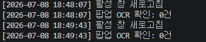
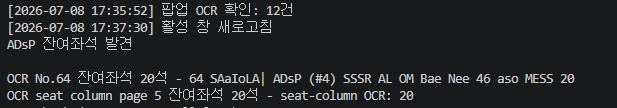
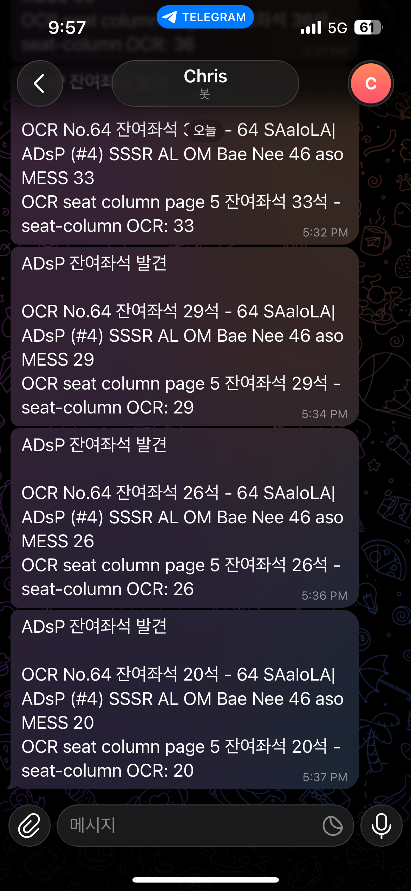

# ADsP Seat Watcher

DataQ 데이터자격검정 ADsP 고사장 목록 화면을 사용자가 직접 열어둔 상태에서, 화면 OCR 또는 클립보드 텍스트를 이용해 잔여좌석을 알려주는 Windows 로컬 보조 도구입니다.

이 프로젝트는 자동 접수 프로그램이 아닙니다. 실제 접수와 결제는 사용자가 DataQ 웹사이트에서 직접 진행합니다.

## 원칙

- 자동 접수 기능 없음
- 자동 결제 기능 없음
- 자동 로그인 기능 없음
- 캡차 우회 기능 없음
- 비밀번호 저장 기능 없음
- DataQ 자동화/개발자도구 감지 우회 없음
- 사용자가 직접 열어둔 화면 또는 직접 복사한 텍스트만 확인

## 주요 기능

- DataQ 고사장 목록 팝업 OCR 감시
- 선택적 새로고침 및 브라우저 확인창 처리
- 긴 팝업 목록 스크롤 감시
- 잔여좌석 숫자 감지 시 콘솔, 비프음, Telegram 알림
- OCR 오류에 대비한 잔여좌석 열 보조 OCR
- 클립보드로 복사한 표 텍스트 수동 감시

## 동작 메커니즘

이 도구는 사용자가 직접 열어둔 일반 Chrome의 DataQ 고사장 팝업을 화면 OCR로 읽습니다. 사이트 내부 API를 호출하거나 자동 접수/결제/로그인을 수행하지 않습니다.

1. 사용자가 DataQ에 직접 로그인하고 ADsP 고사장 목록 팝업을 엽니다.
2. 프로그램이 현재 화면의 지정 영역을 캡처합니다.
3. Tesseract OCR이 화면 텍스트를 읽습니다.
4. 전체 표 OCR과 잔여좌석 열 보조 OCR을 함께 사용해 좌석 숫자를 찾습니다.
5. 잔여좌석이 1 이상으로 판단되면 콘솔, 비프음, Telegram으로 알립니다.
6. `--refresh`를 켠 경우 활성 창을 새로고침하고, `--confirm-resubmit`으로 Chrome의 양식 재제출 확인창을 처리합니다.
7. 긴 목록은 마우스 휠 스크롤로 여러 화면을 훑고 다시 반복합니다.

OCR은 화면 배율, 해상도, 브라우저 창 크기, DataQ UI 변화에 영향을 받습니다. 현재 구현은 실제 잔여좌석 감지 사례와 0석 상태 오탐 검증을 바탕으로 개선했지만, 모든 지역/행/숫자 패턴에서의 정확도를 보장하지는 않습니다.

## 검증 스냅샷

아래 이미지는 실제 운용 중 확인한 테스트 장면입니다. 자세한 디버깅 과정과 남은 검증 과제는 [TESTING_AND_DEBUGGING.md](TESTING_AND_DEBUGGING.md)에 정리했습니다.

### 0석 상태 오탐 없음

전체 잔여좌석이 0석인 상태에서 반복 스캔했을 때 `팝업 OCR 확인: 0건`이 출력되고 Telegram 알림이 가지 않는 것을 확인했습니다.



### 실제 잔여좌석 감지

실제 잔여좌석이 남은 행을 OCR이 감지해 콘솔에 `ADsP 잔여좌석 발견`과 좌석 수를 출력한 사례입니다. OCR 원문이 일부 깨져도 행번호, `ADsP` 키워드, 잔여좌석 열 보조 OCR을 함께 사용해 감지합니다.



### Telegram 휴대폰 알림

감지된 결과는 Telegram Bot API를 통해 사용자의 휴대폰으로 전송됩니다. 외출 중에도 잔여좌석 감지 여부를 확인할 수 있도록 하기 위한 알림 경로입니다.



## 권장 환경

- Windows 10/11
- Python 3.12 이상
- Chrome
- Tesseract OCR
- Telegram 알림을 쓰려면 Telegram Bot token과 chat_id

## 설치

PowerShell에서 실행합니다.

```powershell
cd C:\Users\YOUR_NAME\Desktop\hacks
python -m pip install -r requirements.txt
winget install UB-Mannheim.TesseractOCR
```

Tesseract 기본 경로:

```text
C:\Program Files\Tesseract-OCR\tesseract.exe
```

`python` 명령이 없으면 Python을 먼저 설치하세요.

```powershell
winget install Python.Python.3.12
```

## DataQ 화면 준비

1. 일반 Chrome으로 DataQ 접수 페이지에 접속합니다.
2. 사용자가 직접 로그인합니다.
3. 사용자가 직접 ADsP 접수 화면으로 이동합니다.
4. `시험 고사장 목록` 팝업을 엽니다.
5. 팝업 창을 화면 맨 앞으로 둡니다.

이 도구는 로그인, 접수, 결제, 캡차 처리를 대신하지 않습니다.

## GUI 실행

명령어 옵션을 직접 조합하지 않고, 일반 사용자용 GUI에서 준비 절차를 따라 설정한 뒤 실행하려면 GUI를 사용합니다. GUI는 CustomTkinter 기반이며, 처음에는 단계별 초기 설정을 안내하고 설정이 끝나면 실행 전용 화면으로 전환됩니다.

```powershell
python adsp_watcher_gui.py
```

GUI에서 할 수 있는 일:

- 일반 사용자가 바로 이해할 수 있는 시작 준비 화면
- Telegram 알림, DataQ 화면 준비, 감시 방식, OCR 영역을 별도 창으로 순서대로 확인
- 감시 시작/중지, Telegram 테스트, DataQ 열기를 버튼으로 실행
- OCR 원문, 후보 테이블, CLI 명령어 같은 개발자 정보는 기본 화면에서 숨김
- 문제가 생겼을 때만 `문제 해결 로그` 창에서 내부 로그와 실행 명령 확인
- DataQ 화면 준비, 포커스 좌표, OCR 영역, 동작 옵션을 단계별 설정 창에서 조정
- 활성 DataQ 팝업의 표 텍스트를 자동 복사해 OCR 알림 문구의 한글 행 정보를 보정
- 다크모드 토글
- CustomTkinter 기반의 모던 UI와 단계별 설정 창
- `themes/adsp_customtkinter_theme.json`으로 관리되는 라이트/다크 테마
- `DESIGN_TOKENS`와 `init_theme_system()` 기반의 사용자용 테마 엔진

개발자/운영 검증용 상세 로그와 OCR 후보 검증은 CLI(`adsp_popup_ocr_watcher.py`)를 직접 실행해 확인합니다.

Bot token과 chat_id는 프로그램 실행 중 환경변수로만 전달되며, 파일에 저장하지 않습니다.

## Telegram 알림 설정

1. Telegram에서 `@BotFather`에게 `/newbot`을 보내 봇을 만듭니다.
2. BotFather가 준 token을 따로 보관합니다.
3. 만든 봇에게 `/start` 메시지를 보냅니다.
4. 브라우저에서 아래 주소를 열어 `chat.id` 값을 확인합니다.

```text
https://api.telegram.org/bot봇_TOKEN/getUpdates
```

PowerShell 환경변수로 설정합니다. 토큰을 코드에 저장하지 마세요.

```powershell
$env:TELEGRAM_BOT_TOKEN="봇_TOKEN"
$env:TELEGRAM_CHAT_ID="CHAT_ID"
```

## OCR + 클립보드 보정

OCR은 좌석 숫자와 행 위치를 찾는 데 사용하고, 클립보드는 활성 DataQ 팝업에서 자동 복사한 표 텍스트의 정확한 한글 고사장 정보를 보정하는 데 사용할 수 있습니다.

```powershell
python adsp_popup_ocr_watcher.py --clipboard-assist --auto-copy-clipboard ...
```

이 기능은 접수, 로그인, 결제, 캡차 처리를 하지 않습니다. 사용자가 이미 열어둔 DataQ 고사장 팝업에서 Ctrl+A/C로 표 텍스트만 복사해 알림 문구를 더 읽기 좋게 만듭니다.
## 팝업 OCR 감시 실행

가장 실사용에 가까운 실행 예시는 다음과 같습니다.

```powershell
python adsp_popup_ocr_watcher.py --refresh --confirm-resubmit --interval 40 --pages 15 --scroll-method wheel --wheel-notches 9 --focus-click 900,500 --keep-awake --bbox 0,90,1845,980 --seat-bbox 1535,90,1645,980 --save-text ocr_debug.txt
```

옵션 설명:

- `--refresh`: 활성 창에 F5 새로고침을 보냅니다.
- `--confirm-resubmit`: 새로고침 후 `양식 다시 제출 확인` 창이 뜨면 Enter로 계속합니다.
- `--interval 40`: 한 스캔 사이클이 끝난 뒤 40초 대기합니다.
- `--pages 15`: 여러 화면을 스크롤하며 확인합니다.
- `--scroll-method wheel`: 마우스 휠 방식으로 스크롤합니다.
- `--wheel-notches 9`: 한 번에 내리는 휠 양입니다.
- `--focus-click 900,500`: 새로고침 뒤 본문을 클릭해 포커스를 복구합니다.
- `--keep-awake`: 실행 중 Windows 절전/화면 꺼짐을 줄입니다.
- `--bbox`: 전체 표 OCR 영역입니다.
- `--seat-bbox`: 잔여좌석 열 보조 OCR 영역입니다.
- `--save-text`: OCR 원문을 저장해 오작동을 확인할 수 있게 합니다.

주의: `--message-box` 옵션은 기본적으로 쓰지 않는 것을 권장합니다. 메시지박스가 Chrome 포커스를 뺏어 스크롤 감시를 방해할 수 있습니다.

## 수동 클립보드 감시

자동 새로고침 없이 사용자가 직접 표를 복사해서 확인하려면 다음을 사용합니다.

```powershell
python adsp_manual_clipboard_watcher.py --interval 60
```

일반 Chrome에서 고사장 목록 표 또는 option 텍스트를 직접 복사하면, 클립보드 텍스트를 파싱해 잔여좌석을 확인합니다.

## 일반 화면 OCR 감시

브라우저 조작 없이 현재 화면만 OCR로 읽으려면 다음을 사용합니다.

```powershell
python adsp_ocr_watcher.py --interval 60 --bbox 0,90,1845,980 --save-text ocr_debug.txt
```

화면 갱신은 사용자가 직접 해야 합니다.

## 좌석 감지 방식

우선 다음 텍스트를 파싱합니다.

```text
잔여좌석 : 3
잔여 좌석 : 3
```

OCR에서는 한글 지역명이 깨질 수 있으므로 보조적으로 다음을 확인합니다.

- `ADsP`가 포함된 행에서 마지막 숫자가 1 이상인지 확인
- 지정한 잔여좌석 열 OCR 영역에서 단독 숫자 `1`, `67` 등을 확인

OCR은 완벽하지 않습니다. 실제 접수 가능 여부는 사용자가 DataQ 화면에서 직접 확인해야 합니다.

## 파일 구성

- `adsp_watcher_gui.py`: 설정, Telegram 테스트, 실행/중지를 제공하는 CustomTkinter GUI
- `adsp_popup_ocr_watcher.py`: 팝업 OCR 감시, 선택적 새로고침, Telegram 알림
- `adsp_ocr_watcher.py`: 일반 화면 OCR 감시
- `adsp_manual_clipboard_watcher.py`: 수동 클립보드 텍스트 감시
- `adsp_seat_parser.py`: 좌석 파싱 로직
- `adsp_seat_watcher.py`: Playwright 방식 비권장 안내
- `themes/adsp_customtkinter_theme.json`: GUI 테마 설정
- `requirements.txt`: Python 패키지 목록

## 배포 전 체크리스트

GitHub에 올리기 전에 다음 파일이 포함되지 않게 확인하세요.

- Telegram token 또는 chat_id가 들어간 파일
- `ocr_debug.txt`
- `adsp_popup_hits.log`
- `.vscode/`
- `.codex/`
- `__pycache__/`

## 한계

- OCR 기반이라 화면 배율, 폰트, 브라우저 크기에 영향을 받습니다.
- DataQ 화면 구조가 바뀌면 좌표와 파싱 로직을 조정해야 합니다.
- 좌석이 보였다고 해서 실제 접수 성공을 보장하지 않습니다.
- 접수와 결제는 반드시 사용자가 직접 해야 합니다.

## 윤리적 사용

이 도구는 취소표나 추가 증설 좌석을 사람이 직접 확인하기 위한 알림 보조 도구입니다. 과도한 요청 주기, 자동 접수, 자동 결제, 로그인 자동화, 캡차 우회, 사이트 보호 우회 용도로 사용하지 마세요.
## 새 사용자용 CSS 앱

기존 `adsp_watcher_gui.py`는 CustomTkinter 기반 레거시/개발자용 GUI로 남겨두고, 일반 사용자용 화면은 `adsp_desktop_app.py`와 `ui/` 폴더의 HTML/CSS/JS로 분리했습니다.

이 앱은 Toss 제품 UI에서 참고할 수 있는 단계형 설정 흐름과 명확한 실행 화면 구조를 ADsP Watcher에 맞게 재해석한 버전입니다. 공식 Toss 코드나 브랜드 자산을 복사하지 않고, 넓은 여백, 강한 파란 CTA, 차분한 상태 카드, 단계형 온보딩 같은 제품 구조만 참고했습니다.

실행 전 설치:

```powershell
python -m pip install -r requirements.txt
```

실행:

```powershell
python adsp_desktop_app.py
```

화면 흐름:

1. 처음 설정 안내
2. Telegram Bot token / Chat ID 입력 및 테스트 전송
3. DataQ 팝업 준비 안내
4. 권장 감시값 확인
5. 감시 시작/중지와 최근 이벤트 확인

보안 원칙은 동일합니다. Telegram 정보는 파일에 저장하지 않고 실행 중인 프로세스 환경변수로만 전달합니다. 자동 로그인, 자동 접수, 자동 결제, 캡차 처리, 감지 우회 기능은 포함하지 않습니다.
